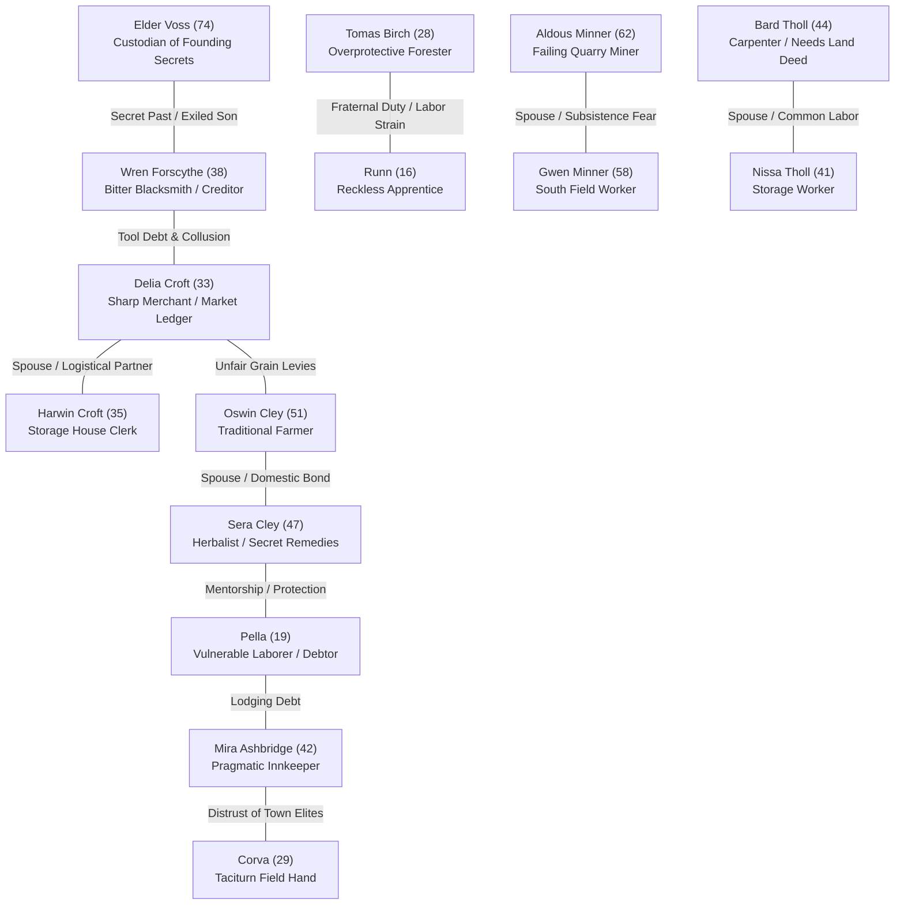
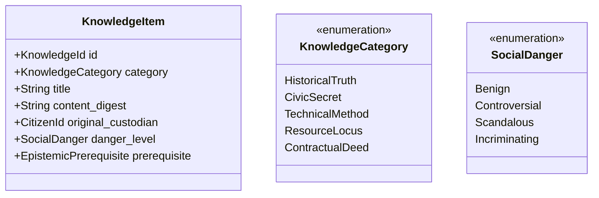

# GODSEED VERTICAL SLICE 2: PRODUCT DOSSIER
## Meaning, Attachment & Consequence in Thornveil

**Document Identifier:** `GODSEED-VS2-DOSSIER-001`  
**Lifecycle State:** `PRODUCT_DEFINITION`  
**Empirical Baseline:** Godseed VS1 Candidate `391d2937379d775d12da2425001ea2fc88b733b4` (`GODSEED_PR_READY_CANDIDATE`, `INDEPENDENT_ACCEPTANCE_PASS`)  
**Target Inhabitation:** Thornveil Settlement (15 Inhabitants, 11 Spatial Nodes)  
**Governing Question:**
> *Can Godseed create a simulated life whose relationships, discoveries, conflicts, consequences, absences, and personal transformation become meaningful enough that the player actually wants to continue living that life?*

---

## 1. VS1 Evidence Baseline

Godseed Vertical Slice 1 established that the foundational mechanical substrate of an embodied, persistent-world simulation functions correctly. Across 20 automated integration suites, 7 multi-persona life runs (30 days each), and a 90-day continuous headless soak test, VS1 verified:

1. **Physical Embodiment & Needs (AC-1):** The player participates in the same ECS physiological substrate (`PhysicalNeeds`) as NPCs. Satiety, rest, and health decay deterministically; starvation and exhaustion produce mortality without cheat protections.
2. **Spatial Containment & Autonomous Routines (AC-2, AC-3):** Thornveil's 15 authored inhabitants follow 24-hour schedules across 11 spatial nodes. Inhabitants autonomously travel between workstations, market stalls, taverns, and homes without teleportation or scripted railroading.
3. **Economic Substrate (AC-5, AC-8):** Production, labor wages, household consumption, and supply/demand price elasticity operate deterministically. Player purchasing and labor measurably move settlement reserves and commodity valuations.
4. **Capability Acquisition & Action Unlocks (AC-6):** Capabilities (Woodcutting, Smithing, Herbalism, Inscription) unlock discrete systemic verbs (`inscribe`, `study`, `work`) rather than passive statistical modifiers.
5. **Transformation Path Foundation (AC-7):** The Inscription path advances from uninitiated outsider to Scholar Stage 1 upon studying the ruined archive, consulting Elder Voss, and inscribing observations.
6. **Persistence & Deterministic Replay (AC-9, AC-10):** Binary state serialization (`GODSEED1` bincode with CRC32 integrity checks) reconstructs bit-identical states across saves, loads, and time advances.
7. **Simulation Soak Survival (AC-12):** Across 2,160 ticks (90 simulated days), zero invariant violations occurred: population survived, currency was conserved, and commodity balances remained sane.

---

## 2. Experience Gaps: What Remains Unproven

While VS1 proved that the simulation has a functioning heartbeat, empirical inspection of player logs and persona traces reveals acute experience gaps. Simulation correctness has not produced dramatic engagement:

1. **Clockwork Inhabitants Without Soul:** Inhabitants in VS1 are essentially mobile schedules. They lack emotional stakes, private grievances, conflicting loyalties, vulnerability, or domestic intimacy. The player does not worry about them, mourn them, or seek their company for reasons other than mechanical utility.
2. **Scalar Rapport Is Not Relationship:** In VS1, social standing is collapsed into a single scalar value (`toward_player: i16`, from -100 to +100) and a `will_teach` threshold. Being at rapport 35 with Delia the merchant feels identical to rapport 35 with Sera the herbalist: both simply flip an arbitrary capability unlock. Real relationships are defined by qualitative history—trust, suspicion, debt, fear, shared complicity, and mutual protection.
3. **Memory Without Narrative Meaning:** `NpcMemory` in VS1 stores a FIFO queue of up to 20 events, but it is aggregated into a scalar score (`disposition = sum(impact)`). NPCs do not remember *why* they dislike the player; they do not bring up past transgressions; they cannot confront the player about a broken promise; and they cannot be lied to.
4. **Knowledge Is a Flat Checklist:** In VS1, `KnowledgeInventory` is a flat `HashSet<u32>`. Knowledge has no owner, no social danger, no custodial responsibility, and no asymmetry. The player cannot know a secret that an NPC is desperately trying to hide, nor can they use documented proof to alter a civic outcome.
5. **Scholar as Skill Grind Rather than Epistemic Transformation:** Reaching Scholar Stage 1 in VS1 consists of typing `inscribe <arbitrary string>` five times and clicking through Elder Voss's dialogue. It does not feel like becoming a literate, dangerous, or revered intellectual in an oral peasant culture. It changes a title string, not the player's epistemic relationship with the settlement.
6. **Absence as Pure Stockpile Extrapolation:** Skipping 30 days in VS1 updates commodity piles and ages characters, but leaves the social landscape frozen. No marriages occurred, no apprenticeships shifted, no debts came due, no feuds boiled over, and no one wondered where the player had gone. The world waited passively for the player's return.
7. **Absence of Retellable Stories:** A player finishing VS1 recounts system interactions: *"I bought food to keep my satiety above 20, chopped wood to pay the innkeeper, and raised Voss's rapport to 60 to become a Scholar."* They do not recount human drama: *"I discovered who stole the founding grain, held the secret to protect Pella, and returned after a month to find Wren had blamed his apprentice."*

---

## 3. VS2 Product Thesis

> **Godseed Vertical Slice 2 transforms Thornveil from a functioning simulation into a world where an embodied player forms lasting attachments and rivalries, wields asymmetric knowledge as social power, alters the destinies of autonomous inhabitants, suffers delayed consequences, and advances along an Inscription/Scholar trajectory that fundamentally changes their identity, agency, and social standing within the settlement.**

### The Core Fantasy Refinement
The player does not begin as a chosen hero, a warlord, or an omniscient overseer. The player arrives as an illiterate, vulnerable outsider in a hardscrabble settlement. They become consequential not through combat levels or magical gifts, but through **what they observe, what they record, who they stand with, whose secrets they keep, and how their actions reverberate across an interconnected human community.**

---

## 4. Target Player Experience

### The 5-Minute Experience: Vulnerable Embodiment & Social Texture
- The player steps onto the packed-mud Settlement Road of Thornveil in the damp chill of dawn.
- They are hungry and have four copper bits. They observe Tomas hauling timber to the storage yard while his teenage brother Runn struggles with an oversized saw.
- Visiting The Slanted Timber, the player overhears an argument between Mira the innkeeper and Pella, a landless young field laborer who owes two weeks of lodging rent.
- The player's physical needs are immediate, but the social world is already moving without them. Every person they see is busy, burdened, and entangled.

### The 30-Minute Experience: The First Entanglement
- Needing shelter and coin, the player chooses an entry point into the local economy. Working North Fields for farmer Oswin Cley provides grain and day wages, but brings the player into contact with Corva, a taciturn laborer who notices Delia's merchant scale tipping unfairly against Oswin's harvest.
- The player learns a piece of asymmetric information: Delia is doctoring grain ledgers to pay off a private tool debt to Wren the blacksmith.
- The player faces an immediate social choice:
  - Confront Delia or expose the ledger (pleasing Oswin, alienating Delia).
  - Approach Wren to understand the debt (entering Wren's sphere of suspicion).
  - Keep silent and trade quietly with Delia for discounted supplies.
- The interaction is not a branch in a dialog tree; it is an economic and social fact that alters how these inhabitants view the newcomer.

### The Multi-Hour Experience: Epistemic Agency & The Scholar's Burden
- The player seeks out the ruined Old Archive at the edge of town. They do not find a loot dungeon; they find decaying parchment, stone foundation markers, and faded inscriptions that the illiterate laborers of Thornveil treat with superstitious dread.
- Under the reluctant tutelage of Elder Voss, the player acquires true **Literacy and Inscription**. 
- Inscription is not typing flavor text into a console. It is the ability to create **binding documents, survey boundaries, transcribe oral contracts, and decipher historical records**.
- Suddenly, the town's balance of power shifts toward the player:
  - Bard Tholl wants a written deed for his carpentry workshop.
  - Elder Voss demands that certain colonial founding records in the archive remain buried.
  - Sera the herbalist secretly asks the player to transcribe her dangerous remedy recipes before her failing memory loses them.
- Being a Scholar makes the player essential, respected, and deeply distrusted.

### The Longitudinal Experience: Absence, Consequence, and Return
- The player commits a major intervention: they draft a formal debt-clearing agreement for Pella, using Sera's rare herb location as collateral, and publicly side with Oswin against Delia's grain levy.
- The player then leaves Thornveil for two simulated months to explore the outer wilderness ridges.
- Upon returning, Thornveil is not a paused game state:
  - Pella is no longer at the inn; she has moved into Sera's herb shed as an apprentice herbalist.
  - Delia greets the player with stony silence, refusing credit and charging triple for salt.
  - Runn was injured in a logging accident during the player's absence because Tomas had to fell timber alone without the player's seasonal labor; Tomas carries a quiet, simmering grief.
  - Elder Voss's health has failed; he sits at the well, clutching an archive key, waiting specifically for the only person in Thornveil who can read what he left behind.
- The player's reaction is involuntary: *"The town moved without me, and my choices left scars."*

---

## 5. Meaning Density Analysis

VS2 adopts the governing principle: **Maximize meaning per inhabitant and meaning per system, rather than increasing population or system count.**

| System / Element | Low-Density Trap (VS1 / Generic RPG) | High-Density Reality (VS2) | New Story Enabled |
| :--- | :--- | :--- | :--- |
| **Inhabitants** | Adding 30 more generic villagers who wander and trade. | Deepening the 15 existing inhabitants with explicit debt, kinship, secrets, and fears. | Discovering that Wren's grudge is tied to the exile of Elder Voss's son, reshaping the smith's entire persona. |
| **Dialogue** | A branching conversation tree with multiple-choice lore dumps. | Topic-based inquiry governed by trust, shared secrets, witnessed events, and active obligations. | An NPC refusing to speak about a missing ledger until the player demonstrates that they can keep a secret from Delia. |
| **Economy** | Abstract price curves fluctuating by ±5% based on settlement grain count. | Personal debt ledgers, credit dependency, tool shortages, and food rationing during crises. | A farmer facing eviction by the merchant unless the player audits the harvest tallies. |
| **Capabilities** | Grinding Woodcutting to Level 2 to get +10% timber yield. | Learning Inscription to draft a legal contract that legally protects a laborer's wages from seizure. | Using literacy to arbitrate a property boundary dispute between two feuding families. |
| **Memory** | A counter incrementing `disposition += 2` on gift give. | Remembering a specific breach of trust, transmitting it via gossip, and citing it weeks later in public. | Being denied a night's lodging at the inn during a freezing storm because Mira remembers you lied to her lodger. |

---

## 6. Thornveil Social Model: The 15 Inhabitants

Rather than adding new characters, VS2 fully activates the latent social, economic, and domestic tensions across the 15 authored citizens in Thornveil:



### Social Tensions in Thornveil
1. **The Debt & Credit Nexus:** Delia Croft extends grain and seed credit to Oswin and the Minner household; in turn, Delia is indebted to Wren for forge iron. A default in the fields ripples directly into the forge.
2. **The Labor & Kinship Strain:** Tomas Birch pushes his young brother Runn to work the timber stands to keep their household solvent. If the player does not assist, Runn is overtaxed, risking catastrophic injury.
3. **The Epistemic Conflict (Oral Tradition vs. Inscribed Law):** Elder Voss and the older generation (Aldous, Oswin) rely on traditional memory and elder authority. Delia and Bard want written accounts and property records. The player's literacy threatens Voss's monopoly on historical truth.
4. **The Domestic Outsiders:** Pella and Corva live at Mira's inn without land or family protection. Pella survives through social charm and gossip; Corva survives through brutal stoic silence. Siding with either changes the social climate of the inn.

---

## 7. Multi-Dimensional Relationship Model

VS2 eliminates single-scalar `rapport = 35`. Inhabitants perceive other entities across **four distinct, interacting social dimensions** (-100 to +100 each):

```text
RELATIONSHIP VECTOR = (Affection, Trust, Obligation, Deference)
```

1. **Affection (Warmth vs. Hostility):**
   - *Experiential Meaning:* Does this person enjoy your company? Do they smile when you enter the tavern, or do they look away?
   - *Gameplay Impact:* Affects willingness to socialize, base prices, hospitality at night, and casual gossip sharing.
2. **Trust (Reliability vs. Suspicion):**
   - *Experiential Meaning:* Do they believe your word? Do they expect you to keep promises? Do they suspect you of hidden motives?
   - *Gameplay Impact:* Unlocks sharing confidential knowledge, access to private property (homes, storerooms), and acceptance of verbal commitments.
3. **Obligation (Debt vs. Entitlement):**
   - *Experiential Meaning:* Who owes whom? Have you performed an uncompensated service, or do you owe them coin, labor, or protection?
   - *Gameplay Impact:* Compels an NPC to act against their immediate preference (e.g., Wren forging a tool despite his hostility because you saved Runn).
4. **Deference (Respect vs. Contempt):**
   - *Experiential Meaning:* Does this person view you as an authority, an equal, or a worthless vagrant?
   - *Gameplay Impact:* Affects whether an NPC will heed your advice, accept your arbitration in disputes, or feel threatened by your presence.

### Qualitative Relationship Archetypes
- **The Grudging Debtor (Affection: -40, Trust: 20, Obligation: +60, Deference: 10):** Wren despises the player's presence, but because the player saved his brother, Wren will grudgingly repair the player's tools at cost while cursing under his breath.
- **The Affectionate Gossip (Affection: +50, Trust: -30, Obligation: 0, Deference: -20):** Pella loves drinking with the player and shares rumors freely, but will never trust the player with her money or believe a promise the player makes.
- **The Wary Respecter (Affection: -10, Trust: +60, Obligation: -10, Deference: +70):** Elder Voss recognizes the player's scholarly discipline and honesty, consulting them on ancient texts while keeping an emotional distance.

---

## 8. Consequential Memory & Narrative Gossip

In VS2, memory is not a discarded FIFO counter. Memory is **structured episodic history** that informs dialogue, goal formation, and social propagation.

### Episodic Memory Structure
Each significant interaction creates an `EpisodicMemory`:
- **Subject & Instigator:** Who did what to whom.
- **Context & Action:** E.g., `DefaultedOnDebt { amount: 15.0, creditor: Delia }`, `InscribedSecretHistory { topic: VossSon }`, `SharedMealDuringStarvation`.
- **Salience (1–10):** How momentous the event was. A minor greeting is Salience 1; saving a life or publicly humiliating an elder is Salience 10.
- **Veracity:** `DirectWitness` vs. `SecondHandGossip(source)`.
- **Emotional Weight:** Impact on Affection, Trust, Obligation, and Deference.

### Decay, Salience & Retention
- Low-salience memories (small talk, standard purchases) fade over 3–7 days.
- High-salience memories (betrayals, life-saving acts, major contracts) **never decay**. They become permanent anchors of that NPC's personal history.
- When an NPC speaks, they reference high-salience memories directly in dialogue:
  > *"You come asking for grain, traveler, but Gwen hasn't forgotten that you bought the last sack from Delia while our kettle was empty."*

### Gossip as Asymmetric Event Propagation
- Inhabitants do not transmit raw scalar numbers. They transmit **narrative episodes**.
- When Pella socializes with Mira at the inn, she shares: *"I saw the outsider giving dried roots to Sera at the garden."*
- Gossip can become **distorted through bias**: If Wren hears second-hand gossip about the player from Delia, his existing suspicion increases the negative valence of the event.

---

## 9. Knowledge as a World Resource

Knowledge in VS2 ceases to be an abstract checkbox. It is an **asymmetric, tradeable, dangerous world commodity**.



### Key Properties of Knowledge
1. **Asymmetry:** An NPC cannot act on knowledge they do not possess. If only the player and Elder Voss know that the Old Archive contains the original land charter, Delia cannot demand a re-survey until the player reveals or transcribes it.
2. **Custodial Danger:** Certain knowledge is dangerous to hold. Possessing *Knowledge of Voss's Exiled Son* makes Wren furious if revealed prematurely and makes Elder Voss defensive.
3. **Epistemic Prerequisites:** To understand a technical manuscript in the archive, the player must possess prior capabilities (Literacy, Herbalism, or Geometry).
4. **Verifiable Inscription:** Knowledge can be committed to physical parchment. A verbal claim is weak; an **Inscribed Document** signed or bearing an authentic seal carries binding social weight.

---

## 10. The Scholar Trajectory: Epistemic Transformation

VS2 rejects the RPG trope of "Scholar" as a spellcaster or statistical class. In Godseed, the Scholar is **the arrival of documentary culture, empirical observation, and historical accountability in an illiterate peasant village.**

### The 4 Stages of the Scholar Life Trajectory

```text
Stage 0: The Illiterate Outsider
  ↓ (Acquire Literacy & Inscription tools)
Stage 1: The Inscriber (Empirical Observer)
  ↓ (Uncover hidden archives, master document drafting)
Stage 2: The Settlement Chronicler (Documentary Authority)
  ↓ (Translate ancient edicts, arbitrate communal truth)
Stage 3: The Keeper of Truth (Social Arbiter / Radical Thinker)
```

### The 7 Transformation Questions for Scholar Advancement

#### 1. What can the player now do that they could not do before?
- Read ancient stone markers, decaying archive tablets, and market ledgers.
- Inscribe legal contracts, debt promissory notes, wills, and boundary surveys.
- Audit settlement trade books to detect fraud or economic imbalance.

#### 2. What can they now understand that they could not understand before?
- The real founding history of Thornveil: why the original settlers fled, why the flood occurred, and why the archive was abandoned.
- The botanical principles behind Sera's cures, enabling compound remedies that prevent harvest plagues.

#### 3. Who reacts differently to them?
- **Elder Voss:** Transitions from paternal condescension to viewing the player as a peer—and an existential threat to his curated communal peace.
- **The Merchants (Delia & Harwin):** Treat the player with professional wariness, requiring the player's seal to validate bulk trade contracts.
- **The Common Laborers (Pella, Corva, Runn):** Regard the player with awe and mild suspicion, asking the player to read letters, record debts, or protect them from exploitation.

#### 4. What new risk exists?
- Inscribing a truth that disrupts social harmony (e.g., proving a household has no legal right to their field) turns families into active enemies.
- Physical parchment and ink are scarce and vulnerable to water, fire, and theft.

#### 5. What new responsibility exists?
- The community looks to the Scholar to arbitrate land, debt, and succession disputes. Refusing to arbitrate causes civic paralysis; arbitrating creates a permanent enemy.

#### 6. What new opportunity exists?
- The player can establish the **Thornveil Civic Archive**, preserving technical and medical knowledge that prevents settlement collapse during harsh winters.

#### 7. What previous problem becomes solvable?
- The persistent, grinding debt cycle between Delia and the farmers can be restructured through written promissory credit rather than emergency starvation auctions.

---

## 11. Delayed Consequences

VS2 explicitly rejects instant "gamey" cause-and-effect. Actions introduce **unresolved social and economic vectors** that develop over days or weeks:

```mermaid
sequenceDiagram
    autonumber
    actor Player
    actor Delia as Delia (Merchant)
    actor Oswin as Oswin (Farmer)
    actor Wren as Wren (Blacksmith)
    
    Player->>Delia: Audits grain ledger; exposes 20% overcharge on seed credit
    Delia-->>Player: Backs down; refunds grain to Oswin (Affection: -40, Trust: -20)
    Note over Delia,Wren: Delayed Vector 1 (Days 1–7): Delia lacks cash to pay Wren for iron stock
    Wren-->>Delia: Halts iron deliveries to market; tool prices double
    Note over Oswin,Wren: Delayed Vector 2 (Days 8–15): Oswin's plow breaks; cannot buy replacement
    Oswin-->>Player: "You saved my grain, Scholar, but now I cannot turn the autumn field."
```

### Principles of Non-Gotcha Delayed Consequences
1. **Intelligible Causality:** Every delayed consequence stems from transparent, simulated rules (credit shortages, labor allocation, emotional resentment). The player can always trace *why* something happened.
2. **Forewarning via Social Signals:** Inhabitants voice intermediate states. Before Wren halts iron deliveries, he complains at the tavern about Delia's unpaid accounts. Attentive players can intervene before the crisis matures.
3. **No Single Perfect Solution:** Interventions shift burdens; they do not erase scarcity. Helping the farmers creates friction with the craftsmen.

---

## 12. Absence and Return: Living Town Progression

The ultimate test of a living world is what happens when the player leaves:

### Autonomous Off-Screen Vector Resolution
When the player departs Thornveil or skips substantial simulated time (14 to 60 days):
- Incomplete social disputes do not freeze. Inhabitants pursue their goals according to their personalities, resources, and relationships.
- Debts fall due. If unpaid, property is forfeited or labor obligations shift.
- Illnesses either heal or claim their victims based on herbalist supplies.
- Inhabitants age, form partnerships, or abandon unviable trades.

### The Return Experience ("What Happened While I Was Gone?")
When the player returns, the game generates an **Epistemic Return Digest** through environmental and conversational discoveries:
- **Visual & Spatial Changes:** A new timber fence at North Fields; a shuttered stall at Market Square; an apprentice apron hanging at the forge.
- **Narrative Salutations:**
  - Mira at the Inn: *"Look who's back. You missed the frost, traveler. Runn took a crushed arm in the timber stand two weeks after you left. Tomas hasn't spoken a dozen words since."*
  - Elder Voss's Empty Bench: The elder is confined to bed, his ledger lying closed in the dust.
- The player immediately realizes that their absence had weight: the town did not wait for its protagonist.

---

## 13. Human Playtest Strategy

Automated headless agents and persona life tests are essential for verifying reachability, invariants, and state divergence. **They cannot measure human meaning, attachment, curiosity, or emotional resonance.**

VS2 requires **3 to 5 supervised human play sessions** (2 to 4 hours each) with real players before product acceptance.

### Qualitative Evaluation Instruments

```text
┌────────────────────────────────────────────────────────────────────────┐
│                   HUMAN PLAYTEST EVALUATION SUITE                     │
├────────────────────────────────┬───────────────────────────────────────┤
│ Instrument 1: Story Retelling  │ Players summarize their playthrough in│
│                                │ their own words without prompts.      │
├────────────────────────────────┼───────────────────────────────────────┤
│ Instrument 2: Curiosity Audit  │ Unprompted questions asked by player  │
│                                │ during and after the session.         │
├────────────────────────────────┼───────────────────────────────────────┤
│ Instrument 3: Character Recall │ Inhabitants remembered by name,       │
│                                │ occupation, and personal conflict.    │
├────────────────────────────────┼───────────────────────────────────────┤
│ Instrument 4: Absence Reaction │ Spontaneous verbal/emotional response │
│                                │ upon returning after a 30-day skip.   │
└────────────────────────────────┴───────────────────────────────────────┘
```

### The Story Retelling Test Standard
- **Failure Signal (System-Language):** *"I raised my inscription skill to 2, managed my hunger bar with bread, and got the elder's rapport to 60."*
- **Success Signal (Narrative-Language):** *"I tried to help Pella get out of debt with the innkeeper, but when I exposed the merchant's fake ledger, Wren stopped making tools and Oswin couldn't plow his field. When I came back after a month, Pella had become the herbalist's apprentice and wouldn't talk to me."*

### The Curiosity Standard
The playtest passes the Curiosity Test if the player voluntarily asks at least **three unprompted systemic questions** such as:
- *"Does Wren know that Delia owes him money because she bought grain for the Minners?"*
- *"Can I teach Runn how to read so he doesn't have to work the timber stands?"*
- *"What will happen to the archive if Elder Voss dies while I'm away?"*

---

## 14. Proposed VS2 Minimum System Set

To achieve the product thesis without feature bloat, VS2 proposes exactly **five tightly focused systems**:

### 1. Multi-Dimensional Relationship Ledger
```text
SYSTEM: Multi-Dimensional Relationship Ledger
PLAYER EXPERIENCE PROBLEM: NPCs feel like identical vending machines gated by a single rapport integer.
WHY VS1 IS INSUFFICIENT: VS1 only tracks toward_player: i16 (-100..+100) and will_teach threshold.
NEW STORY ENABLED: An enemy who owes you a debt must help you; a dear friend who distrusts your discretion refuses to share a secret.
DEPENDENCIES: CitizenMeta, RelationshipLedger resource.
EXPECTED COST: Moderate ECS data migration; low runtime overhead.
VALIDATION METHOD: Automated relationship archetype matrix test + human qualitative dialogue testing.
WHAT HAPPENS IF WE OMIT IT: Relationships remain shallow, transactional stat-gates.
```

### 2. Episodic Consequential Memory & Narrative Gossip
```text
SYSTEM: Episodic Consequential Memory & Narrative Gossip
PLAYER EXPERIENCE PROBLEM: NPCs don't remember specific player actions or bring up history in dialogue.
WHY VS1 IS INSUFFICIENT: VS1 sums 20 FIFO event impacts into a disposition delta and emits generic string templates.
NEW STORY ENABLED: An NPC confronts the player about a specific betrayal witnessed two weeks earlier, which has spread to three other villagers.
DEPENDENCIES: Multi-Dimensional Relationship Ledger, EventRing.
EXPECTED COST: High ECS design attention (salience pruning to prevent memory bloat); low compute cost.
VALIDATION METHOD: Memory salience decay test; multi-hop narrative gossip propagation verification.
WHAT HAPPENS IF WE OMIT IT: The world feels amnesiac and indifferent to player deeds.
```

### 3. Asymmetric Knowledge & Epistemic Resource System
```text
SYSTEM: Asymmetric Knowledge & Epistemic Resource System
PLAYER EXPERIENCE PROBLEM: Information is not a world power; the player cannot uncover or wield secrets that change NPC behavior.
WHY VS1 IS INSUFFICIENT: VS1 KnowledgeInventory is a flat boolean HashSet<u32> without ownership, custody, or social danger.
NEW STORY ENABLED: The player discovers proof of a fraudulent land boundary, choosing whether to blackmail the merchant, comfort the farmer, or burn the record.
DEPENDENCIES: Episodic Memory, ContentDefinitions.
EXPECTED COST: Moderate.
VALIDATION METHOD: Knowledge transmission verification tests; asymmetric behavior branch checks.
WHAT HAPPENS IF WE OMIT IT: The Scholar path has nothing meaningful to discover or protect.
```

### 4. Inscription & Document Authority System (Scholar Stage 2)
```text
SYSTEM: Inscription & Document Authority System
PLAYER EXPERIENCE PROBLEM: Inscription is just typing flavor text into a console command to tick an advancement counter.
WHY VS1 IS INSUFFICIENT: VS1 inscribe generates no physical or social artifact; it just sets inscriptions_completed += 1.
NEW STORY ENABLED: The player crafts a written debt charter that legally binds Delia and Pella, becoming the settlement's recognized documentary authority.
DEPENDENCIES: Asymmetric Knowledge, CapabilitySet, Inventory.
EXPECTED COST: Moderate.
VALIDATION METHOD: Document creation, signature, and verification integration tests.
WHAT HAPPENS IF WE OMIT IT: The Scholar fantasy collapses into a passive RPG lore-hound.
```

### 5. Social Vector Progression Engine (Delayed Consequences & Absence Resolution)
```text
SYSTEM: Social Vector Progression Engine
PLAYER EXPERIENCE PROBLEM: Time skips and departures leave the human settlement frozen in amber.
WHY VS1 IS INSUFFICIENT: VS1 skips only advance commodity consumption and age ticks; unresolved social tensions never progress.
NEW STORY ENABLED: Leaving Thornveil for a month causes an unaddressed debt dispute to culminate in an eviction and an apprentice transfer before the player returns.
DEPENDENCIES: Multi-Dimensional Relationship Ledger, Episodic Memory, HouseholdRef.
EXPECTED COST: High conceptual design, moderate compute overhead during long ticks.
VALIDATION METHOD: Automated 30-day absence divergence test; state diff audit upon return.
WHAT HAPPENS IF WE OMIT IT: The signature Godseed promise of "a living world that moves without you" is false.
```

---

## 15. Proposed Experience Acceptance Criteria

VS2 will be judged against **10 concrete, non-gameable experiential acceptance criteria**:

- **AC-201 (Qualitative Relational Divergence):** At least two NPCs must exhibit divergent behavioral responses to the identical player request (e.g., lodging, loan, teaching) based on differing combinations of Affection, Trust, and Obligation, rather than a single rapport threshold.
- **AC-202 (Episodic Narrative Recall):** An NPC remembered action of Salience $\ge 7$ must be explicitly cited by that NPC in dialogue at least 14 simulated days after the event occurred, altering at least one available dialogue option.
- **AC-203 (Multi-Hop Narrative Gossip):** A high-salience player action witnessed by Citizen A must propagate to Citizen B and Citizen C through co-located socializing, altering Citizen C's trust before Citizen C has met the player.
- **AC-204 (Asymmetric Epistemic Leverage):** The player must be able to acquire at least one documented fact unknown to a target NPC, and revealing that fact must cause the NPC to alter an ongoing economic or social decision.
- **AC-205 (Documentary Authority):** Reaching Scholar Stage 2 must unlock the creation of Inscribed Documents (Charters, Promissory Notes) that resolve or transform an otherwise intractable dispute between two NPCs.
- **AC-206 (Epistemic Backlash):** Transcribing or revealing a controversial historical truth must cause at least one NPC's relationship vector to degrade into active hostility or fear while increasing another's trust.
- **AC-207 (Intelligible Delayed Consequence):** A player intervention in Week 1 must trigger a secondary consequence in Week 3 that was not immediately resolved upon action completion, but whose causal chain is fully auditable in the event telemetry.
- **AC-208 (Autonomous Absence Continuation):** An ongoing social tension involving two NPCs must advance through at least one major state transition during a 30-day player absence, producing observable physical and conversational changes upon return.
- **AC-209 (Human Story Retelling Pass):** In at least 3 out of 5 supervised human playtests, players must summarize their playthrough using characters, motives, personal dilemmas, and consequences rather than game mechanics or statistical meters.
- **AC-210 (Human Curiosity Pass):** In at least 4 out of 5 human playtests, players must unpromptedly inquire about the motivations, hidden knowledge, or autonomous future of at least two specific Thornveil inhabitants.

---

## 16. Fun Hypotheses

| ID | Hypothesis | Success Evidence | Falsification / Failure Condition |
| :--- | :--- | :--- | :--- |
| **FH-201** | **Interpersonal Attachment:** Players remember individual inhabitants as distinct people with unique struggles. | Human testers refer to NPCs by name and express emotional preferences (e.g., protective of Runn, annoyed by Delia). | Players refer to NPCs by function ("the blacksmith", "the quest guy") or confuse their household ties. |
| **FH-202** | **Consequential Weight:** Players deliberate before taking actions because they anticipate lasting world memory. | Testers hesitate, ask about potential fallout, or choose non-optimal economic routes to preserve trust. | Testers click through choices purely to optimize coin or capability XP. |
| **FH-203** | **Spontaneous Epistemic Curiosity:** Players actively investigate world history and secrets without quest markers. | Players spend time in the archive, inspect monuments, and ask NPCs about the founding unprompted. | Players ignore the archive unless explicitly ordered to visit it for a reward. |
| **FH-204** | **Scholar Identity Transformation:** Players view the Scholar as a distinct way of being in the world, not just a skill tree. | Players use literacy to arbitrate disputes, record contracts, and protect vulnerable NPCs. | Players treat Inscription as a chore required to unlock higher-tier crafting. |
| **FH-205** | **Absence Continuity Intrigue:** Returning after a long journey creates genuine curiosity about settlement evolution. | Players immediately tour the town upon return, asking *"What happened while I was away?"* | Players ignore the town upon return and immediately resume routine resource grinding. |
| **FH-206** | **Emergent Retelling Diversity:** Different players starting from the same initial conditions produce dramatically divergent personal stories. | Retold stories across 5 testers feature different alliances, rivalries, household outcomes, and moral stances. | All testers tell essentially the same linear sequence of events. |

---

## 17. Scope Exclusions: What VS2 Deliberately Refuses to Build

To preserve design focus and ensure execution feasibility, the following features are **STRICTLY EXCLUDED** from VS2:

1. **No Continental Expansion or Multiple Settlements:** Thornveil remains the sole settlement. No traveling to capital cities, foreign ports, or secondary hamlets.
2. **No Population Growth:** The settlement population remains capped at the 15 authored inhabitants. No procedural NPC generation, migrant hordes, or dynamic births.
3. **No Combat or Violence System:** No swords, bows, hit points, bandit raids, or military skirmishes. Conflict must remain social, economic, legal, and epistemic.
4. **No Other Transformation Paths:** No Warrior, Merchant Lord, Mystic, or Craftsman paths. VS2 tests the **Scholar/Inscriber path exclusively**.
5. **No 2D/3D Graphical Frontends:** Godseed remains a headless simulation engine driving a high-clarity terminal text RPG interface.
6. **No LLM Hallucinations in the Simulation Loop:** All simulation state, memory, gossip, and consequences remain deterministic ECS logic. Generative AI may not be used as an unpredictable runtime crutch.
7. **No Procedural World Generation:** Thornveil's layout (11 spatial nodes) remains fixed and carefully authored.

---

## 18. Architectural Pressure

*Note: In accordance with governance constraints, the following points represent design pressure that the downstream architecture phase must solve, NOT final architectural decisions.*

1. **Component Overhead of Multi-Dimensional Relationships:** Moving from a single scalar to a 4-dimensional vector across all NPC pairs could increase relationship memory from $O(N)$ (player-only) to $O(N^2)$ (all citizen pairs). With $N=15$, $15 \times 15 = 225$ records, which is trivial (~9 KB), but requires a clean ECS storage representation.
2. **Episodic Memory Growth and Pruning:** Without bounded retention policies, `EpisodicMemory` could cause memory leaks during long-running soak tests. Architecture must define salience-based garbage collection rules for low-impact events.
3. **Document Representation in ECS:** Inscribed documents (deeds, promissory notes, records) must exist as portable inventory items, persistent archive records, and inspectable objects with verifiable signatures.
4. **Off-Screen Simulation Budget during Fast Skips:** Advancing 60 days in a single command requires resolving social vector progressions without executing full micro-tick routines for every second. Architecture must define an efficient "macro-tick" or vector resolution pipeline.
5. **Dialogue Generation from Structured Facts:** The UI needs a clean, template-driven or grammatic assembly system that translates structured episodic memories into natural, evocative prose without hardcoding thousands of fragile strings.

---

## 19. Risks

1. **The "Boring Bureaucrat" Risk:** Focusing on literacy, ledgers, and contracts could make gameplay feel like medieval accounting rather than an immersive RPG.  
   *Mitigation:* Keep stakes intensely personal. The contract isn't about filing taxes; it's about whether Pella gets thrown into the winter cold or whether Wren seizes Oswin's only plow.
2. **Invisible Consequence Risk:** Delayed consequences might mature while the player is unaware, leading players to assume changes were random bugs.  
   *Mitigation:* Provide clear narrative tracing upon return. NPCs must explicitly state causal connections in their dialogue.
3. **Cognitive Overload Risk:** If 15 NPCs all have complex secrets, players may become bewildered by the social web.  
   *Mitigation:* Structure the town around clear initial anchor relationships (Mira at the Inn, Voss at the Archive, Delia at the Market), letting players uncover secondary connections at their own pace.

---

## 20. Unknowns

1. **Optimal Salience Thresholds:** What numerical threshold differentiates a memory that should last 3 days from one that should last forever? (Requires empirical playtest tuning).
2. **Tolerable Time-Skip Intervals:** How long can a player leave Thornveil before the town feels *too* different, breaking continuity rather than rewarding it?
3. **Player Tolerance for Social Failure:** How do players react when an intervention fails and permanently damages an NPC relationship with no "reload save" crutch?

---

## 21. Recommendation

**The analysis firmly supports advancing Godseed into Vertical Slice 2.**

The baseline established by VS1 provides a rock-solid, deterministic foundation. The five proposed systems directly attack the fundamental flaw of simulation prototypes: high technical complexity with low emotional resonance. By constraining scope to Thornveil's 15 inhabitants and focusing exclusively on the Scholar's epistemic journey, VS2 has a sharply bounded, achievable, and profoundly original design envelope.

**Final Disposition:**
`GODSEED_VS2_PRODUCT_CONTRACT_READY_FOR_REVIEW`
